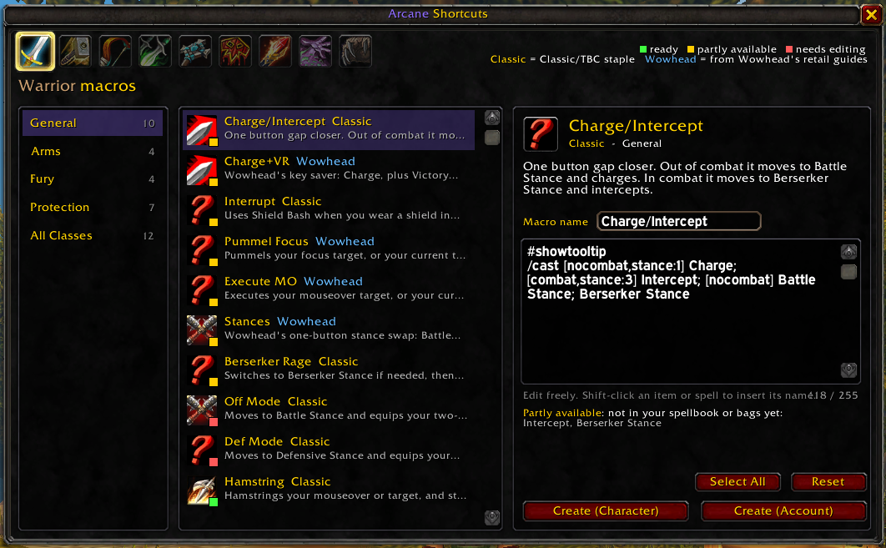
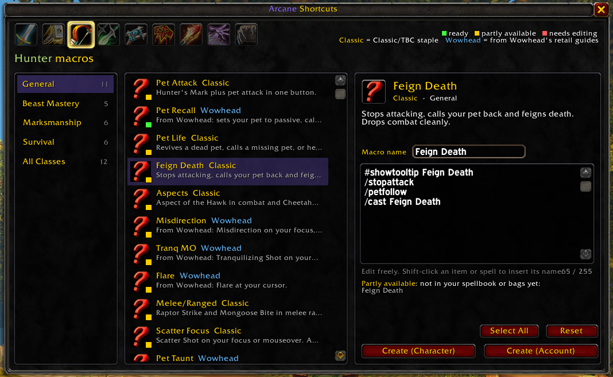

# Arcane Shortcuts

**Ready-to-use macros for every class and spec in WoW Forever. Pick one, tweak it, and put it on your action bar in two clicks.**

Writing macros by hand is fiddly. You have to remember the conditionals, fit everything into 255 characters, and spell every name exactly right. Arcane Shortcuts gives you a library of about 245 tested macros for all 9 classes. You can read, edit and create them without leaving the game.

---

## Features

- **Macros for every class and spec.** Warrior, Paladin, Hunter, Rogue, Priest, Shaman, Mage, Warlock and Druid each have a General list and a list for every talent spec. Druids get separate Cat and Bear lists.
- **An "All Classes" list.** Includes trinkets, mount, potions, bandages, eat & drink, focus, raid markers, sell greys and more.
- **Each macro is explained.** Every macro has a short description of what it does and when to use it.
- **Checked against your character.** Each macro gets a colored dot:
  - 🟢 **Ready**: you know every spell in it.
  - 🟡 **Partly available**: it shows which spells or items you don't have yet, such as a talent you haven't picked or a spell you haven't trained.
  - 🔴 **Needs editing**: it has a `<placeholder>` for you to fill in, such as the name of your trinket or potion.
- **Edit before you create.** Change the name and text however you like. A character counter keeps you under the 255-character limit.
- **Shift-click to insert.** Shift-click an item in your bags or a spell in your spellbook to type its name into the macro, just like in the default macro window.
- **Choose an icon.** Left-click the icon to step through the icons of the spells and items in the macro, or keep the dynamic **?** icon so the button changes with the macro.
- **Create with one click.** Choose **Create (Character)** or **Create (Account)**. The macro is saved and lands on your cursor, so you can drop it straight onto an action bar.
- **Safe to click again.** If a macro with the same name already exists, it is updated instead of duplicated.
- **Classic and Wowhead macros.** Macros marked **Classic** are Classic/TBC staples. Macros marked **Wowhead** are adapted from Wowhead's spec guides and rewritten for the Classic client.

---

## How to use

1. Type **`/as`** or click the book icon on your minimap.
2. The window opens on your own class. Click another class icon at the top to browse its macros.
3. Choose a category on the left (General, a spec, or All Classes), then click a macro.
4. Read the description, check the colored status and edit the text if you want.
5. Click **Create (Character)** or **Create (Account)**, then drop the macro on your action bar.

Click **Reset** to undo your edits and get the original macro back.

### Slash commands

| Command | What it does |
|---|---|
| `/as` or `/arcaneshortcuts` | Open or close the window |
| `/as minimap` | Hide or show the minimap button |

You can drag the minimap button around the edge of the minimap.

---

## Good to know

- **Macros can't be created in combat.** This is a game rule. Wait until combat ends and click again.
- **Character or Account?** Character macros exist only on the character you're playing. Account macros are shared by all your characters. Both have a limited number of slots, and the addon tells you if they're full.
- **"Partly available" isn't an error.** WoW Forever mixes Classic with some TBC spells, and you may not have every spell yet. The macro still works for the parts you do have, and the missing spells start working as soon as you learn them.
- **Racials and pet abilities are optional.** Cooldown macros may include racials like Blood Fury or Berserking, and hunter macros may include abilities only some pets have. A missing one doesn't count against the status.

---

## Installation

**CurseForge app:** search for *Arcane Shortcuts* and click Install.

**By hand:**
1. Download and unzip the addon.
2. Put the `ArcaneShortcuts` folder in `World of Warcraft\_classic_beta_\Interface\AddOns\`.
3. Restart the game, or type `/reload` if it's already running.
4. Make sure **Arcane Shortcuts** is enabled in the AddOns list on the character select screen.

---

## Feedback

Did a macro break, or does a spell have a different name on WoW Forever? Do you know a great macro that's missing? Please open an issue or leave a comment. Reports that include the macro name and your class help the most.
